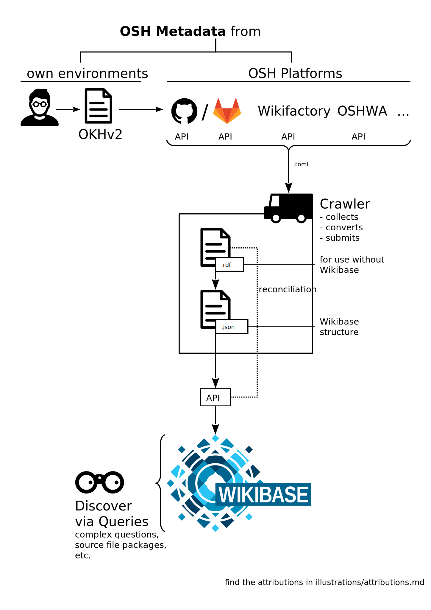

# OSHI

**_The Open Source Hardware Internet - technical documentation in an open graph database._**

## Intro

### tl;dr

connecting open source hardware modules in a graph database – the ICT infrastructure for community-based innovation and circular economy

### long

Some very special advantages of open source technologies only come to effect when we start to connect them. Especially hardware.

Through open source hardware (OSH) we can share design files, assembly instructions, operation and maintenance guides, recycling guidelines, structural analyses, calculations & simulations etc. – and attached to OSH modules they become as modular as the hardware itself.

Just as developer can re-use design files to avoid reinventing the wheel, they can re-use documentation of any kind. Applied to calculations, developer could access the cumulated experience of countless OSH modules that have been realised and tested in practise and hence assess e.g. boundary conditions or the dimension of certain components much faster and on a much more reliable basis. What once was the undisclosed know-how of large, specialised enterprises can become a public pool of knowledge.

**We want to organise open source hardware in a graph database.**

There's a [longlist](Wikibase_Qs.md) of interesting information that could be derived from such a database (also regarding compatibility between OSH modules).

For version 1.0 we will focus on hardware only. Ideas for later, compatible databases are:

- standard parts
- calculation tables & machine-readable standards (e.g. regarding welding parameters)
- manufacturers (to match e.g. design requirements with suitable manufacturing lines nearby)
- funding opportunities (to match e.g. funding requirements with OSH projects)

Standards are the backbone for this approach.

### short & crisp

We are aiming to build the (real) Internet of Things – the Internet of Open Hardware.

## Scope

### tl;dr Q&A

**What is the domain that the ontology will cover?**

Now: Open Source Hardware\
In the future: standard parts, software, manufacturers, tools, funding opportunities,…

**Who's the enduser you have in mind?**

1. developers\
  the whole thing here is first and foremost about **design reuse**
2. manufacturers / service providers\
  find OSH ready for decentralised (mass) production, maintenance and service provision

**What's the problem this thing is solving? Or rather, how does this 'tool' look like?**

1. It's a powerful filter for OSH. Find what you acutally need.
2. It's a knowledge base capable to
   1. answer complex questions like "What kind of power contoller is commonly used for this sort of hardware?";
   2. cross-link information (e.g. ongoing research with OSH designs (e.g. in case of COVID-19)).

**What are use cases of the ontology?**

- find the OSH that solves your problem (→ **linking OSH modules with functional categories**)
  - filter for license, certificate, functional categories, file formats…
  - e.g. search for corona-related projects
- …or fits into _your_ OSH (→ **linking OSH modules, facilitate design reuse**)
- map of usage, hence compatibility between OSH Modules (_this_ module is also included _that_ assembly and thus seemingly works in this environment)
  - this is BTW not limited to OSH; proprietary hardware can be linked as well; this may help reducing (electronic) waste or finding appropriate wear parts
- provide portable metadata: OSH can be published on various platforms
- facilitate packaging: standardised metadata shall enable a "download button" for:
  - production files (export only)
  - developer files (sources only)
  - complete clone (export + sources)
- custom/future use cases are enabled by linking to other data/knowledge bases such as
  - Wikidata
  - Journal of Open Hardware

**Who will use and maintain the ontology?**

1. all the awesome communities that provide the ontology modules we are using; namingly everything that Wikidata uses
2. us; the few things built on top of the ontologies in 1. are to be maintained by us

## Technical details

**How does the dataflow generally work?**

- backend: wikibase
  - version x.x.x
  - used onthology modules
    - xxx
    - xxx
    - …
- frontend: The Open Hardware Observatory ([oho.wiki](en.oho.wiki)) (=wikimedia extension)
- open standards used:
  - The [DIN SPEC 3105](https://gitlab.com/OSEGermany/OHS) (to be published under CC BY-SA 4.0 in June 2020) and the [OH-TsDC](https://gitlab.com/OSEGermany/oh-tsdc) define clear, enforceable criteria for technical documentation of OSH (+ a community-based assessment procedure in order to prove that)
  - The [Open Know-How Metadata Standard](https://app.standardsrepo.com/MakerNetAlliance/OpenKnowHow/src/branch/master/1) gives a first approach to organise OSH through reasonable metadata.

## Want to contribute [?]

'til we have a proper conribution guide,
just join our group on [telegram](https://t.me/joinchat/FiYCVhD-NPfpMr5PnZaiNQ) :)

## Why are we doing this?

I feel this quote gives a neat, compact explanation:

"Human history, closely explored, boils down to the history of invention of better tools."\
– Ernst Knapp: cultural geographer (1808-1896)
